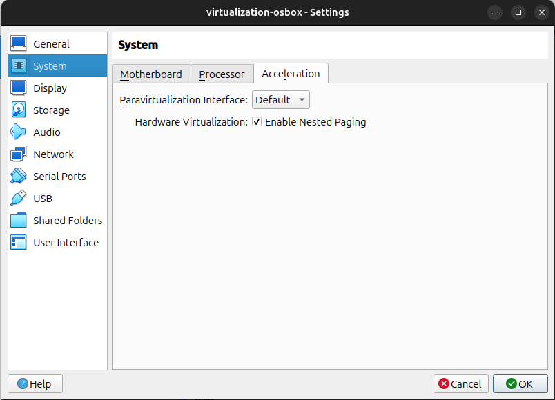

# VirtualBox Setup With an OVA File
Author: Edward Chang (edward.chang@utexas.edu) <br>
Date: August 22, 2024

**Contents:**
- [Background](#background)
- [VirtualBox and Deploying VM From OVA File](#virtualBox_and_deploying_vm_from_ova_file)
- [References / Appendix](#reference)
- [System or Tools Information](#tool_information)

<a id="background"></a>

## Background

You can setup a VM from an Open Virtual Appliance or Application (OVA) file (.ova file).  An .ova file is a package format used for the distribution of Virtual machines (VMs).  This allows users to transfer, distribute, and deploy a VM with a single file.  The .ova file archive will typically contain the following:

* .ovf (Open virtualization Format) file
* .vmdk (Virtual Machine Disk) file
* .mf (Manifest) file

A user can import an .ova file with a virtualization platform (e.g., VMware VM Player, VirtualBox) or any other hypervisor that supports the OVF standard.

<div style="text-align: center;">


</div>

In this article I will go over steps to setup a VM from an .ova file that will run on VirtualBox.  Specifically, I will be doing this in Linux Ubuntu 24.04.

Download a version of VirtualBox that will run on your operating system: https://www.virtualbox.org/wiki/Downloads

<a id="virtualBox_and_deploying_vm_from_ova_file"></a>

## VirtualBox and Deploying VM From OVA File

### Pre-Conditions

* Verify your machine meets the requirements listed in the End-user documentation (https://www.virtualbox.org/wiki/End-user_documentation).

### Steps

1. Install VirtualBox

    For Linux Ubuntu, you run the following commands:
    
    ```
    sudo dpkg -i package_file_name_and_or_location.deb 
    ```

2. Select "Import" and select the .ova file.

    

3. For this walkthrough, in the next screen, I'll accept the defaults and select "Finish".


From here, I can use the VM or further configure it for my use case.

<a id="reference"></a>

# References / Appendix

Helpful references for additional guidance and context information

* Distributed Management Task Force (DMTF) - Open Virtualization Format Standards, (DMTF, https://www.dmtf.org/standards/ovf)
* Open Virtualization Format Wiki (Wikipedia, https://en.wikipedia.org/wiki/Open_Virtualization_Format)
* What is an Open Virtual Appliance (OVA) (ITU Online, https://www.ituonline.com/tech-definitions/what-is-an-open-virtual-appliance-ova)

## Virtualization Development Tip
If you are doing virtualization development be sure to enable the following configurations to use Intel VT-x and EPT.

**Enabling Intel VT-x or AMD-V**


**Enabling Intel EPT**



## Troubleshoot Tips

### vboxconfig Issue when starting VM


Follow the suggestion from the error and run
```
sudo /sbin/vboxconfig
```

### Issue running /sbin/vboxconfig

```
user@MACHINE-NAME:~/Downloads$ sudo /sbin/vboxconfig
[sudo] password for user: 
vboxdrv.sh: Stopping VirtualBox services.
vboxdrv.sh: Starting VirtualBox services.
vboxdrv.sh: Building VirtualBox kernel modules.
This system is currently not set up to build kernel modules.
Please install the gcc make perl packages from your distribution.
This system is currently not set up to build kernel modules.
Please install the gcc make perl packages from your distribution.

There were problems setting up VirtualBox.  To re-start the set-up process, run
  /sbin/vboxconfig
as root.  If your system is using EFI Secure Boot you may need to sign the
kernel modules (vboxdrv, vboxnetflt, vboxnetadp, vboxpci) before you can load
them. Please see your Linux system's documentation for more information.
```

You can install the individual packages as stated in the message.  If you are using your machine for build / development work you can also install the build-essential package.

```
sudo apt-get install build-essential
```


<a id="tool_information"></a>

## System or Tools Information

| Item              | Description |
| -                 | - |
| OS                | Linux Ubuntu 24.04 |
| Architecture      | x86_64 |
| CPU op-mode(s)    | 32-bit, 64-bit |
| CPU(s)            | 8 |
| Model name        | Intel(R) Core(TM) i7-4770K CPU @ 3.50GHz |
| Core(s) per socket| 4 |
| Virtualization    | VT-x |
| Memory            | 16244608 kB |

Source from `lscpu` and `grep MemTotal /proc/meminfo`