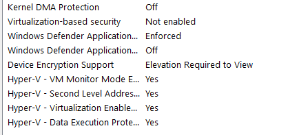
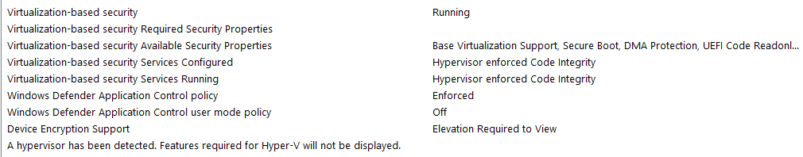
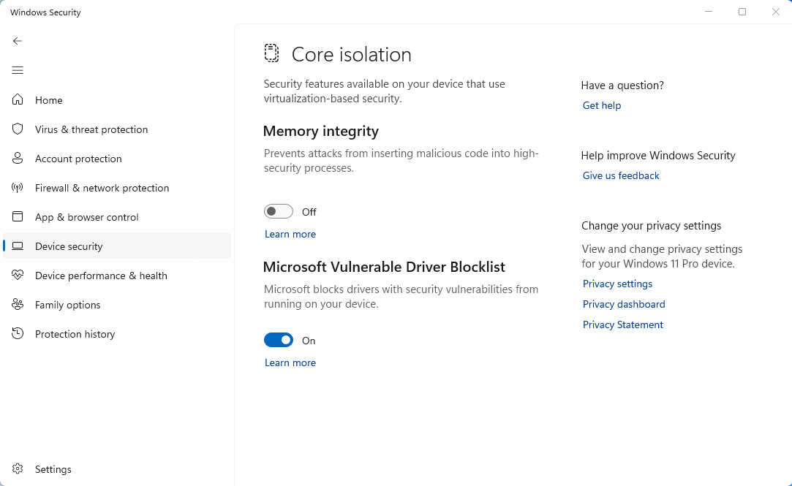
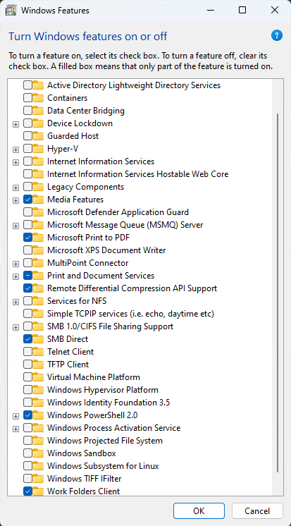
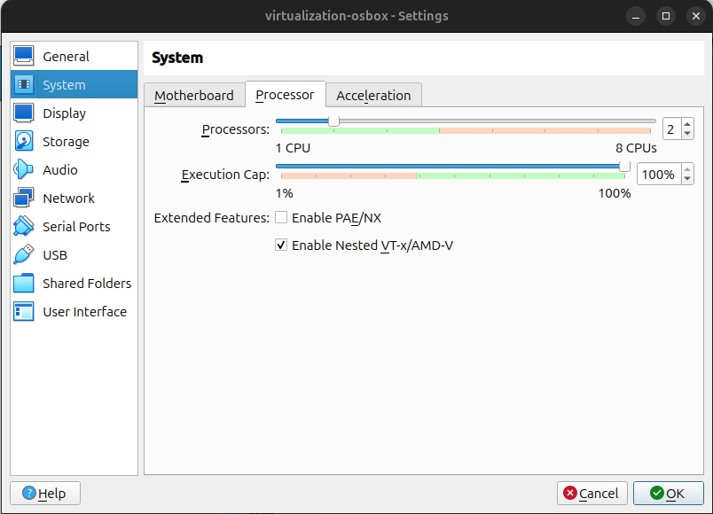
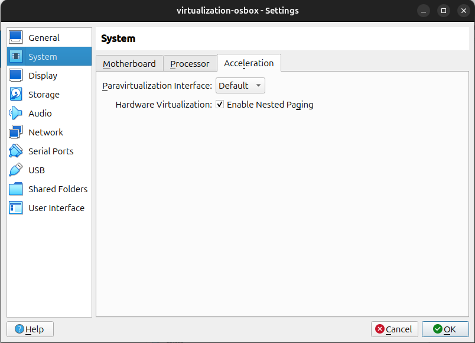
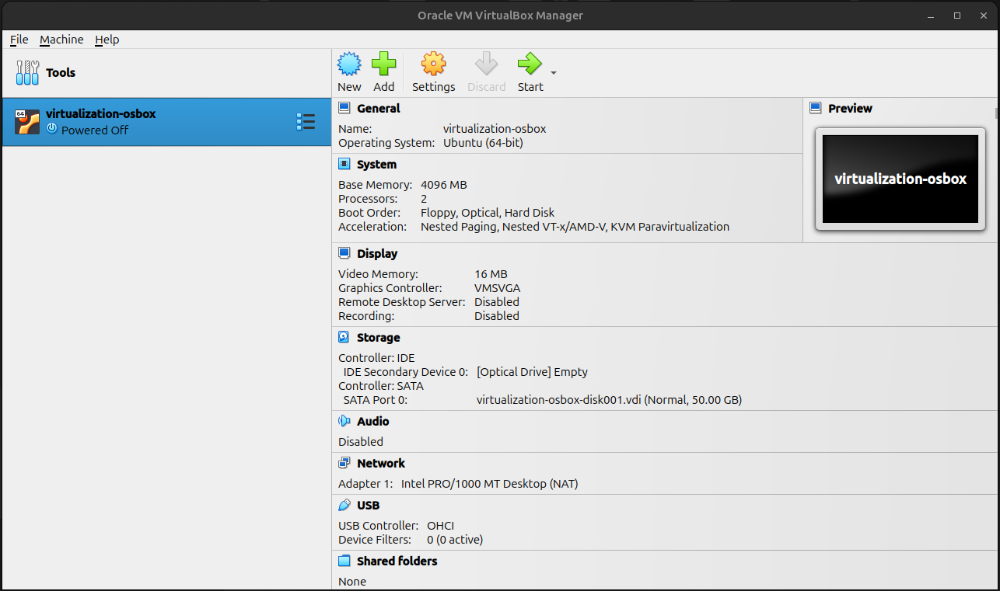
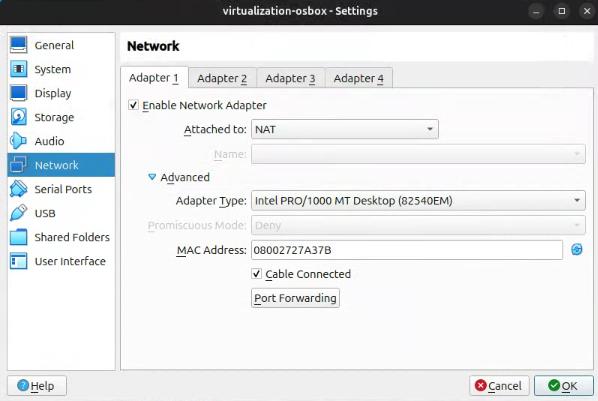
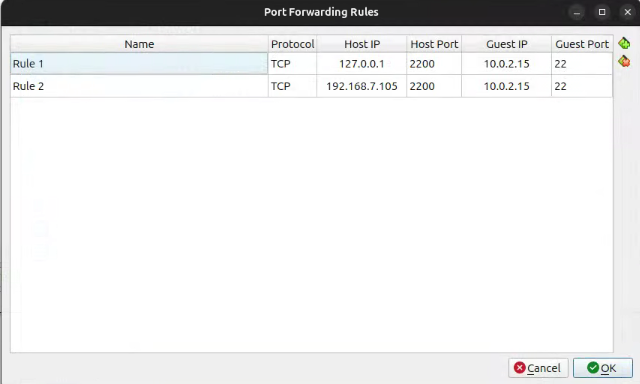

# Setting up Your Machine for CS395T Virtualization
Author: Edward Chang (edward.chang@utexas.edu) <br>
Date: September 07, 2024

**Contents:** 
- [Background](#background)
- [Intel Machine Setup](#intel_machine_setup)
- [Windows 11 Configurations](#win_11_configs)
- [Ubuntu 24.04 Configurations](#ubuntu_configs)
- [VirtualBox Configuration](#vb_config)
- [References / Appendix](#reference)
- [System or Tools Information](#tool_information)

<a id="background"></a>

## Background

<div style="text-align:center">
  
</div>

The CS 395T Virtualization course elective has labs that teaches you how to create Virtual Machines using Intel Virtualization Technology.

* Intel Virtualization Technology (VT-x / VMX)
* Intel Extended Page Tables (ETP) / Nested Page Tables

In this article, I will go over steps to configure your Intel machine for local development of a Virtual Machine Manager (VMM).

<a id="intel_machine_setup"></a>

## Intel Machine Setup

### Pre-Conditions

* Verify your machine has an Intel chip that supports the Intel Virtualization Technology mentioned in the "Background" section above.
* Verify your BIOS is configured correctly enabling Intel Virtualization Technology.  Each PC or Laptop motherboard manufacturer is different on where this setting is located.  Refer to the Manufacturer for guidance.
* This article assumes you are either using Windows 11 or Ubuntu 24.04.
* Confirm there's not an always-running hypervisor running on your operating system.  Only one hypervisor can use Intel Virtualization Technology at a time (this is a big issue for Windows 11 machines).

<a id="win_11_configs"></a>

## Windows 11 Configurations

### Disable Windows 11 Hypervisors

Verify your Windows 11 OS is ready to run VMware Player or VirtualBox with direct access to Intel Virtualization Technology.

In the CMD, PowerShell, or Windows Terminal running either CMD or PowerShell, run the following commands:

```
C:\Users\user> systeminfo
```

Under "Hyper-V Requirements", if you see the following, then a Windows hypervisor (e.g., Hyper-V, Virtual Machine Platform, etc.) is running

```
Hyper-V Requirements:      A hypervisor has been detected. Features required for Hyper-V will not be displayed.
```

Note: You can visually see this information in the "System Information" tool.

**Good**



**Bad**



Notes:

* Virtualization-based security should be "Not enabled"
* "A hypervisor has been detected. Features required for Hyper-V will not be displayed." should not be displayed at the bottom.  Instead a list of hyper-V requirements should be shown as seen in the above "Good" screenshot.

### Troubleshoot Steps to Disable Windows 11 Hypervisors

#### Windows Security

Under "Device Security", go to "Core isolation" - "Core isolation details" and toggle off "Memory Integrity.  Restart your computer. 

Generally this step is enough to turn off Virtual-based security and you can confirm this in System Information GUI.



Note: If this doesn't work you can look at disabling this through a registry edit, but be careful when applying this change.  See the referenced tom's hardware article on how to do this.

#### Windows Virtualization Platform and Hypervisors

Make sure Windows Features that uses Intel Virtualization Technologies are turned off.
* Containers
* Hyper-V
* Microsoft Defender Application Guard
* Virtual Machine Platform
* Windows Hypervisor Platform
* Windows Sandbox
* Windows Subsystem for Linux (WSL)



<a id="ubuntu_configs"></a>

## Ubuntu 24.04 Configurations

You do not need to do any additional configuration.  If you need to check your CPU, its flags, or kvm you can refer to the "Linux Find Out If CPU Support Intel VT/AMD-V Virtualization for KVM" Article in the [References / Appendix](#reference) section.

<a id="vb_config"></a>

## VirtualBox Configuration ##

Be sure to enable the following VM configurations to use Intel VT-x and EPT.

### Enabling Intel VT-x or AMD-V ###



### Enabling Intel EPT ###



### Confirming VM Config ###

Under "Acceleration:", you will see the following enabled: "Nested Paging, Nested VT-x/AMD-V, KVM Paravirtualization"



### Setup Port Forwarding on a NAT Connection ###

Do this if you plan to `ssh` / `scp` into your VM or will be doing VS Code with `ssh` development.





Doing this will allow you to run the following commands:

```
# The two examples below are for connecting to the VM from a terminal program that's on the same machine as the VM.
# ssh example
ssh -p 2200 vos@localhost

# scp example
scp -P 2200 jos-vmm-project.zip vos@localhost:/home/vos/.ssh

# The two examples below are for connecting to the network computer that is hosting your VM.\
# ssh example
ssh -p 2200 vos@192.168.1.105

# scp example
scp -P 2200 jos-vmm-project.zip vos@192.168.1.105:/home/vos/.ssh
```

Notes: 
* You could use a Bridged connection.
* If you plan to do router port forwarding, so your VM is exposed to the internet, then ensure you harden your VM from unwanted access and attacks.  For example, turning on ufw firewall and using ssh key only access (meaning, disabling password authentication).  This will require you to do addition ssh config and agent configuration on the machine you are using to connect to the VM.

<a id="reference"></a>

# References / Appendix

Helpful references for additional guidance and context information

* How to Disable VBS and Speed Up Windows 11 or 10, (2023-Mar-15, tom's Hardware, https://www.tomshardware.com/how-to/disable-vbs-windows-11)
* Linux Find Out If CPU Support Intel VT/AMD-V Virtualization for KVM, (2023-Jun-24, cyberciti, https://www.cyberciti.biz/faq/linux-xen-vmware-kvm-intel-vt-amd-v-support/)

<a id="tool_information"></a>

## System or Tools Information

This article was written using the following Systems.

| Item              | Description |
| -                 | - |
| OS                | Linux Ubuntu 24.04 |
| Architecture      | x86_64 |
| CPU op-mode(s)    | 32-bit, 64-bit |
| CPU(s)            | 8 |
| Model name        | Intel(R) Core(TM) i7-4770K CPU @ 3.50GHz |
| Core(s) per socket| 4 |
| Virtualization    | VT-x |
| Memory            | 16244608 kB |

Source from `lscpu` and `grep MemTotal /proc/meminfo`

| Item              | Description |
| -                 | - |
| OS                | Windows 11 Pro |
| Architecture      | x86_64 |
| CPU op-mode(s)    | 32-bit, 64-bit |
| CPU(s)            | 16 |
| Model name        | Processor	Intel(R) Core(TM) i9-9900K CPU @ 3.60GHz, 3600 Mhz, 8 Core(s), 16 Logical Processor(s) |
| Core(s) per socket| 8 |
| Virtualization    | VT-x |
| Memory            | 32,703 MB GB |

Soruce from `systeminfo` or System Information GUI